# Advanced Computational Natal Chart Analysis: System Architecture

## Architecture Overview

This diagram illustrates the integrated software architecture for comprehensive Vedic astrology (Jyotisha) natal chart analysis, synthesizing traditional paradigms with modern computational frameworks.

```mermaid
graph TD
    A["🌍 Birth Data Input"] -->|Exact Time & Coordinates| B["Core Calculation Engine"]
    
    B --> C1["Rashi Chart<br/>D-1: Physical Life"]
    B --> C2["House Division Systems"]
    B --> C3["Ascendant Variations"]
    
    C2 --> D1["Whole Sign<br/>Rashi"]
    C2 --> D2["Equal House<br/>Sripati"]
    C2 --> D3["Placidus<br/>KP System"]
    
    C3 --> E1["Primary Lagna<br/>Geographic Ascendant"]
    C3 --> E2["Chandra Lagna<br/>Moon Point"]
    C3 --> E3["Surya Lagna<br/>Sun Point"]
    C3 --> E4["Vishesha Lagnas<br/>Special Ascendants"]
    
    E4 --> E4a["Bhava Lagna"]
    E4 --> E4b["Hora Lagna"]
    E4 --> E4c["Ghatika Lagna"]
    
    C1 --> F["Sudarshan Chakra<br/>Tri-Perspective Analysis"]
    
    F --> G["Divisional Charts<br/>Shodashavarga System"]
    
    G --> H1["D-1: Rashi<br/>General Life"]
    G --> H2["D-2: Hora<br/>Wealth"]
    G --> H3["D-9: Navamsha<br/>Marriage & Dharma"]
    G --> H4["D-10: Dashamsha<br/>Career"]
    G --> H5["D-12: Dwadashamsha<br/>Parents & Lineage"]
    G --> H6["D-60: Shashtiamsha<br/>Past Life Karma"]
    G --> H7["D-20: Vimshamsha<br/>Spirituality"]
    G --> H8["Higher Esoteric<br/>D-81, D-108, D-144, D-150"]
    
    H1 --> I["Planetary Strength Analysis"]
    H3 --> I
    H4 --> I
    H6 --> I
    
    I --> J1["Vimshopaka Bala<br/>20-Point Integrity Score"]
    I --> J2["Shadbala<br/>6-Fold Kinetic Strength"]
    I --> J3["Avasthas<br/>Planetary States"]
    
    J2 --> J2a["Sthana Bala: Position"]
    J2 --> J2b["Dik Bala: Direction"]
    J2 --> J2c["Kala Bala: Time"]
    J2 --> J2d["Chesta Bala: Motion"]
    J2 --> J2e["Naisargika Bala: Natural"]
    J2 --> J2f["Drik Bala: Aspects"]
    
    J3 --> J3a["Baladi Avasthas<br/>Age States"]
    J3 --> J3b["Shayanadi Avasthas<br/>Subconscious States"]
    
    I --> K["Esoteric Points & Shadow Entities"]
    
    K --> L1["Bhrigu Bindu<br/>Point of Destiny"]
    K --> L2["Upagrahas<br/>Shadow Planets"]
    
    L2 --> L2a["Dhuma Group<br/>Sun-Based"]
    L2 --> L2b["Gulika & Mandi<br/>Saturn-Based"]
    
    L2a --> L2a1["Dhuma: Obscuration"]
    L2a --> L2a2["Vyatipata: Calamity"]
    L2a --> L2a3["Parivesha: Halo"]
    L2a --> L2a4["Indrachapa: Rainbow"]
    L2a --> L2a5["Upaketu: Trauma"]
    
    I --> M["Jaimini System Analysis"]
    
    M --> N1["Chara Karakas<br/>Variable Significators"]
    M --> N2["Jaimini Aspects<br/>Modality-Based"]
    M --> N3["Arudha Padas<br/>Derived Points"]
    
    N1 --> N1a["Atmakaraka<br/>Soul Significator"]
    N1 --> N1b["Amatyakaraka<br/>Career"]
    N1 --> N1c["Darakaraka<br/>Spouse"]
    
    M --> O["Karakamsha Chart<br/>Spiritual Perspective"]
    
    I --> P["Krishnamurti Paddhati<br/>KP System"]
    
    P --> Q["Placidus Houses<br/>Deterministic"]
    P --> R["Star Lord Analysis<br/>Nakshatra Ruler"]
    P --> S["Sub-Lord Precision<br/>Dasha Significator"]
    P --> T["Ruling Planets<br/>Confirmation"]
    
    J1 --> U["Dynamic Timing Systems"]
    H3 --> U
    
    U --> V1["Vimshottari Dasha<br/>120-Year Cycle"]
    U --> V2["Alternate Dashas<br/>24+ Systems"]
    U --> V3["Sub-Dasha Layers<br/>5 Levels Deep"]
    
    U --> W1["Varshaphala<br/>Solar Return"]
    U --> W2["Tithi Pravesh<br/>Lunar Return"]
    
    U --> X["Transit Analysis<br/>Ashtakavarga"]
    
    X --> X1["Samudaya AAV<br/>Overall Score"]
    X --> X2["Kaksha Timing<br/>Weekly Events"]
    
    V1 --> Y["Predictive Timeline"]
    V2 --> Y
    W1 --> Y
    W2 --> Y
    X --> Y
    
    Y --> Z["📊 Comprehensive Natal Chart Report<br/>Event Timing & Life Trajectory"]
```

## System Components

### 1. **Input Layer**
- Birth date, time (to the second), and geographical coordinates
- Rectification tools for imprecise birth times

### 2. **Foundational Frameworks**
- **Rashi Chart (D-1)**: The macroscopic view of physical life
- **Sudarshan Chakra**: Tri-perspective analysis (Ascendant, Moon, Sun)
- **House Division Systems**: Whole Sign, Equal, Sripati, Placidus
- **Special Ascendants**: Bhava, Hora, Ghatika Lagnas

### 3. **Divisional Chart Engine**
The Shodashavarga (16-chart) system fractures the zodiac into progressively smaller micro-domains:
- **D-1 to D-9**: Core life domains (wealth, siblings, marriage, career)
- **D-10 to D-60**: Specialized analysis (education, spirituality, past karma)
- **D-81 to D-150**: Hyper-esoteric divisions for advanced practitioners

### 4. **Planetary Strength Analysis**
- **Vimshopaka Bala**: 20-point integrity metric across all Vargas
- **Shadbala**: Six-fold kinetic strength (positional, directional, temporal, motional, natural, aspectual)
- **Avasthas**: Psychological and biological states of planets

### 5. **Esoteric & Shadow Entities**
- **Bhrigu Bindu**: The karmic fulcrum between Rahu and Moon
- **Upagrahas**: Shadow planets representing bondage, disease, and destiny (Dhuma, Vyatipata, Gulika, Mandi, etc.)

### 6. **Complementary Systems**
- **Jaimini**: Variable significators and modality-based aspects
- **Krishnamurti Paddhati (KP)**: Deterministic event timing via Sub-Lords

### 7. **Dynamic Timing Layer**
- **Dashas**: Vimshottari and 24+ alternative systems
- **Annual Returns**: Varshaphala (solar) and Tithi Pravesh (luni-solar)
- **Transit Analysis**: Ashtakavarga and Kaksha micro-timing

### 8. **Output Layer**
- Comprehensive natal chart interpretation
- Event timeline with precise predictive windows
- Psychological, karmic, and spiritual insights

## Key Architectural Principles

1. **Multi-Perspective Integration**: No single frame of reference defines destiny; analysis requires simultaneous evaluation through Rashi, Vargas, rotated Lagnas, and complementary systems.

2. **Mathematical Rigor**: Every interpretation rests on quantifiable metrics (Balas, Vimshopaka, Ashtakavarga) rather than qualitative guessing.

3. **Layered Complexity**: From the macro (Rashi chart) to the micro (D-150 Nadiamsha), each layer reveals progressively deeper karmic patterns.

4. **Deterministic Precision**: KP and Placidus systems enable acute event timing, while Parashari and Jaimini provide archetypal, psychological context.

5. **Shadow Integration**: Upagrahas and Bhrigu Bindu account for inexplicable suffering and destiny that visible planets alone cannot explain.

6. **Temporal Dynamism**: Static natal positions transform into a living timeline through Dashas, transits, and annual returns, revealing *when* latent potential manifests.

---

**Citation**: This architecture synthesizes methodologies detailed in the *Brihat Parashara Hora Shastra*, Jaimini Sutras, Krishnamurti Paddhati, Prashna Marga, and contemporary computational astrological frameworks as endorsed by institutions such as Bharatiya Vidya Bhavan and Potti Sreeramulu Telugu University.
